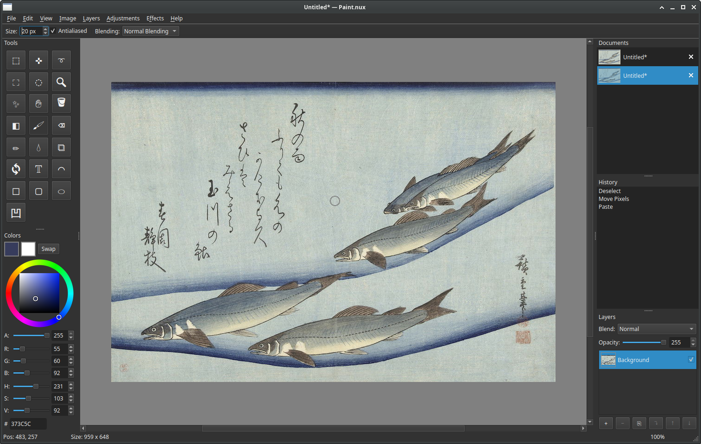

# Paint.nux

A native raster image editor inspired by Paint.NET, built with C++20 and Qt6.

This project was written entirely by LLM (Claude) with human supervision, and will continue to be maintained by said LLM. It serves as a test and demonstration of current AI coding capabilities with limited human involvement.




## Dependencies

- **C++20** compiler (GCC 12+ or Clang 15+)
- **CMake** 3.20+
- **Qt6** — Core, Gui, Widgets, Concurrent, PrintSupport, Network modules
- **GoogleTest** *(optional, for tests only)* — fetched automatically via CMake FetchContent when `-DBUILD_TESTING=ON`

### Installing dependencies

**macOS (Homebrew):**
```bash
brew install cmake qt
```

**Ubuntu / Debian:**
```bash
sudo apt install build-essential cmake qt6-base-dev libqt6concurrent6 libqt6printsupport6
```

**Fedora:**
```bash
sudo dnf install gcc-c++ cmake qt6-qtbase-devel
```

**Arch:**
```bash
sudo pacman -S base-devel cmake qt6-base
```

## Building

```bash
cmake -B build -DCMAKE_BUILD_TYPE=Debug
cmake --build build --parallel
```

For a release build:
```bash
cmake -B build -DCMAKE_BUILD_TYPE=Release
cmake --build build --parallel
```

## Running

```bash
./build/paintnux
```

## Testing

Tests are optional and not built by default. To build with tests:

```bash
cmake -B build -DCMAKE_BUILD_TYPE=Debug -DBUILD_TESTING=ON
cmake --build build --parallel
```

Run the fast test suite (~70 tests, runs in ~1 second):
```bash
ctest --test-dir build
# or directly:
./build/paintnux_tests
```

Run the exhaustive test suite (~120 additional tests covering effects, adjustments, history, file I/O, selection, and resampling):
```bash
./build/paintnux_tests_exhaustive
```

The exhaustive suite is not part of `ctest` and must be run manually.

## Project Structure

```
paintnux/
  src/
    core/         # ColorBgra, Surface, BlendOps
    data/         # Document, BitmapLayer, Selection, FileIO
    history/      # HistoryStack, undo/redo mementos
    adjustments/  # 8 image adjustments
    effects/      # 15 image effects
    tools/        # 22 tools (brush, selection, shape, etc.)
    ui/           # MainWindow, CanvasWidget, docks, toolbars
    app/          # main.cpp entry point
  tests/          # GoogleTest test files
```

Libraries build in dependency order: `core -> data -> history -> adjustments/effects -> tools -> ui -> app`.

## Issues and Contributing

Please report bugs and feature requests via [GitHub Issues](../../issues).

This project is maintained primarily by LLMs with human oversight. If you'd like to contribute, pull requests are welcome — just know that an AI will probably be the one reviewing your code.

## License

[MIT](LICENSE)
